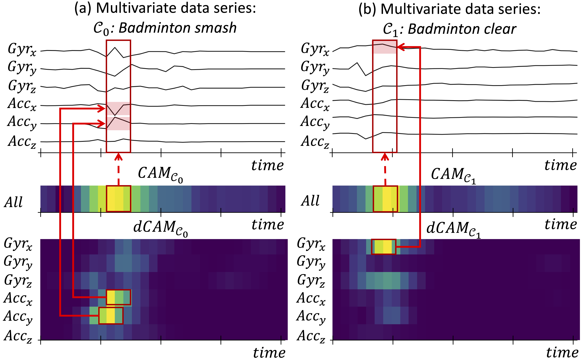

# dCAM : Dimension-wise Class Activation Map for Explaining Multivariate Time Series Classification

<p align="center">

</p>

## Abstract

Data series classification is an important and challenging problem in data science. Explaining the classification decisions by finding the discriminant parts of the input that led the algorithm to some decision is a real need in many applications. Convolutional neural networks perform well for the data series classification task; though,the explanations provided by this type of algorithms are poor for the specific case of multivariate data series. Solving this important limitation is a significant challenge. We propose a novel method that addresses the above challenge by highlighting both the temporal and dimensional discriminant information. Our contribution is two-fold: we first describe a new convolutional architecture that enables the comparison of dimensions; then, we propose a novel method that returns dCAM, a Dimension-wise ClassActivation Map specifically designed for multivariate time series. 

This repository is dedicated to [our paper](https://dl.acm.org/doi/abs/10.1145/3514221.3526183) titled "dCAM : Dimension-wise Class Activation Map for Explaining Multivariate Time Series Classification" published in the [Proceedings of the 2022 International Conference on Management of Data](https://dl.acm.org/doi/proceedings/10.1145/3514221) also available on [here](https://www.researchgate.net/publication/361416963_dCAM_Dimension-wise_Class_Activation_Map_for_Explaining_Multivariate_Data_Series_Classification).

## Data 
The data used in this project comes from two sources: 
- The [UCR/UEA archive](http://timeseriesclassification.com/TSC.zip). Informations are provided in the data folder in order to download our datasets.

## Code 
The code is divided as follows: 
- The [src/](https://github.com/boniolp/dCAM/tree/main/src) folder that contains:
  - [CNN_models.py](https://github.com/boniolp/dCAM/blob/main/src/models/CNN_models.py):
    - CNN architecture (class ConvNet)
    - dCNN/cCNN architecture (class ConvNet2D)
    - ResNet architecture (class ResNet)
    - dResNet/cResNet architecture (class dResNet)
    - Inception Time architecture (class inceptiontime)
    - dInception Time/cInception Time architecture (class dinceptiontime)
    - CNN-MTEX architecture (class ConvNetMTEX)
  - [RNN_models.py](https://github.com/boniolp/dCAM/blob/main/src/models/RNN_models.py):
    - LSTM architecture (class LSTMClassifier)
    - RNN architecture (class RNNClassifier)
    - GRU architecture (class GRUClassifier)

  - the [explanation/](https://github.com/boniolp/dCAM/blob/main/src/explanation/) folder:
    - [CAM](https://github.com/boniolp/dCAM/blob/main/src/explanation/CAM.py) code (class CAM)
    - [cCAM](https://github.com/boniolp/dCAM/blob/main/src/explanation/cCAM.py) code (class cCAM)
    - [dCAM](https://github.com/boniolp/dCAM/blob/main/src/explanation/DCAM.py) code (class DCAM)
    - [grad-CAM](https://github.com/boniolp/dCAM/blob/main/src/explanation/grad_cam_mtex.py) code used for CNN-MTEX (class GradCAM)

- The [examples/](https://github.com/boniolp/dCAM/tree/main/examples) folder that contains:
  - [Synthetic_experiment-CAM.ipynb](https://github.com/boniolp/dCAM/tree/main/examples/Synthetic_experiment-CAM.ipynb): An example on how to use CNN-based models and the Class Activation Map.
  - [Synthetic_experiment_DCAM.ipynb](https://github.com/boniolp/dCAM/tree/main/examples/Synthetic_experiment_DCAM.ipynb): An example on how to use dCNN-based models and the dCAM.

- The [experiments/](https://github.com/boniolp/dCAM/tree/main/experiments) folder that contains:
  - [classification/](https://github.com/boniolp/dCAM/tree/main/experiments/classification): scripts in order to reproduce our classification results.
  - [explanation/](https://github.com/boniolp/dCAM/tree/main/experiments/explanation/): scripts in order to reproduce our explanation results.
  - [execution_time/](https://github.com/boniolp/dCAM/tree/main/experiments/execution_time/): scripts in order to reproduce our execution_time results.

- [Results_overview.ipynb](https://github.com/boniolp/dCAM/blob/main/Results_overview.ipynb): Notebook containing all the informations and the procedures to run the [experiments/](https://github.com/boniolp/dCAM/tree/main/experiments) scripts and generate the figures in our [paper](https://www.researchgate.net/publication/361416963_dCAM_Dimension-wise_Class_Activation_Map_for_Explaining_Multivariate_Data_Series_Classification).

## Prerequisites

All python packages needed are listed in [requirements.txt](https://github.com/boniolp/dCAM/blob/main/requirements.txt) file and can be installed simply using the pip command: 

```(bash) 
pip install -r requirements.txt
``` 

[Jupyter notebook](https://jupyter.org/install) should be installed. To do so, please run the following command:

```(bash) 
pip install notebook
``` 

Overall, the required python packages are listed as follows:
* [numpy](http://www.numpy.org/)
* [pandas](https://pandas.pydata.org/)
* [sklearn](http://scikit-learn.org/stable/)
* [matplotlib](https://matplotlib.org/) 
* [pytorch](https://pytorch.org/)
* [tqdm](https://github.com/tqdm/tqdm)
* [torchsummary](https://github.com/sksq96/pytorch-summary)
* [scipy](https://www.scipy.org/) 

## Reference

If you re-use this work, please cite:

```
@inproceedings{DBLP:conf/sigmod/BoniolMRP22,
  author    = {Paul Boniol and
               Mohammed Meftah and
               Emmanuel Remy and
               Themis Palpanas},
  editor    = {Zachary Ives and
               Angela Bonifati and
               Amr El Abbadi},
  title     = {dCAM: Dimension-wise Class Activation Map for Explaining Multivariate
               Data Series Classification},
  booktitle = {{SIGMOD} '22: International Conference on Management of Data, Philadelphia,
               PA, USA, June 12 - 17, 2022},
  pages     = {1175--1189},
  publisher = {{ACM}},
  year      = {2022},
  url       = {https://doi.org/10.1145/3514221.3526183},
  doi       = {10.1145/3514221.3526183},
  timestamp = {Tue, 14 Jun 2022 18:31:24 +0200},
  biburl    = {https://dblp.org/rec/conf/sigmod/BoniolMRP22.bib},
  bibsource = {dblp computer science bibliography, https://dblp.org}
}
```
